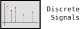

<figure>
  
  <figcaption>
    A domain specific language for modeling and manipulating discrete
    time signals.
  </figcaption>
</figure>

[](https://travis-ci.org/mvcisback/DiscreteSignals)
[](https://codecov.io/gh/mvcisback/DiscreteSignals)


[](https://badge.fury.io/py/discrete-signals)
[](https://opensource.org/licenses/MIT)

# About

This library aims to provide a domain specific language for modeling
and manipulating discrete time signals. Intuitively, most of the time,
the discrete time signal's value is undefined.

If `discrete-signals` isn't for you, I recommend checking out
[traces](https://github.com/datascopeanalytics/traces) (which this
library took design inspiration from). Both libraries offer a
convenient way to model unevenly-spaced discrete time signals.

# Installation

`$ pip install discrete-signals`

# Usage

```python
from discrete_signals import signal

x = signal([(0, 1), (1, 2), (2, 3)], start=0, end=10, tag='x')
y = signal([(0.5, 'a'), (1, 'b'), (2, 'c')], start=0, end=3, tag='y')

print(x)
# start, end: [0, 10)
# data: [(0, {'x': 1}), (1, {'x': 2}), (2, {'x': 3})]

print(y)
# start, end: [0, 3)
# data: [(0.5, {'y': 'a'}), (1, {'y': 'b'}), (2, {'y': 'c'})]
```

## Parallel Composition

```python
print(x | y)
# start, end: [0, 10)
# data: [(0, {'x': 1}), (0.5, {'y': 'a'}), (1, {'x': 2, 'y': 'b'}), (2, {'x': 3, 'y': 'c'})]
```

## Concatenation

```python
print(x @ y)
# start, end: [0, 13)
# data: [(0, {'x': 1}), (1, {'x': 2}), (2, {'x': 3}), (10.5, {'y': 'a'}), (11, {'y': 'b'}), (12, {'y': 'c'})]
```

## Retagging/Relabeling

```python
print(x.retag({'x': 'z'}))
# start, end: [0, 10)
# data: [(0, {'z': 1}), (1, {'z': 2}), (2, {'z': 3})]
```

## Time shifting

```python
print(x >> 1.1)
# start, end: [1.1, 11.1)
# data: [(1.1, {'x': 1}), (2.1, {'x': 2}), (3.1, {'x': 3})]

print(x << 1)
# start, end: [-1, 9)
# data: [(-1, {'x': 1}), (0, {'x': 2}), (1, {'x': 3})]
```

## Slicing

```python
print(x[1:])
# start, end: [1, 10)
# data: [(1, {'x': 2}), (2, {'x': 3})]

print(x[:1])
# start, end: [0, 1)
# data: [(0, {'x': 1})]
```

## Rolling Window

```python
print(x.rolling(1, 3))
# start, end: [-1, 7)
# data: [(-1, {'x': (1, 2)}), (0, {'x': (2, 3)}), (1, {'x': (3,)})]
```

## Mapping a Function

```python
print(x.map(lambda val: str(val['x']), tag='z'))
# start, end: [0, 10)
# data: [(0, {'z': '1'}), (1, {'z': '2'}), (2, {'z': '3'})]
```


## Piecewise Constant Interpolation

```python
print(x.interp(0))
# {'x': 1}

print(x.interp(0.1))
# {'x': 1}

print(x.interp(1))
# {'x': 2}
```


## Attributes
```python
print((x | y).tags)
# {'x', 'y'}

print(x.values())
# SortedDict_values([defaultdict(None, {'x': 1}), defaultdict(None, {'x': 2}), defaultdict(None, {'x': 3})])

print(list(x.times()))
# [0, 1, 2]
```
